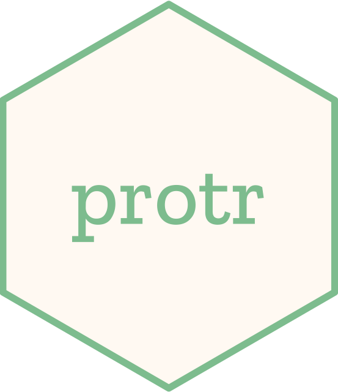

# protr  

<!-- badges: start -->
[](https://github.com/nanxstats/protr/actions/workflows/R-CMD-check.yaml)
[](https://cran.r-project.org/package=protr)
[](https://cranlogs.r-pkg.org/badges/protr)
<!-- badges: end -->

Comprehensive toolkit for generating various numerical features of protein sequences described in Xiao et al. (2015) ([PDF](https://nanx.me/papers/protr.pdf)).

## Paper citation

Formatted citation:

Nan Xiao, Dong-Sheng Cao, Min-Feng Zhu, Qing-Song Xu (2015). protr/ProtrWeb: R package and web server for generating various numerical representation schemes of protein sequences. _Bioinformatics_, **31**(11), 1857--1859.

BibTeX entry:

```
@article{Xiao2015,
  author  = {Xiao, Nan and Cao, Dong-Sheng and Zhu, Min-Feng and Xu, Qing-Song.},
  title   = {protr/{ProtrWeb}: {R} package and web server for generating various numerical representation schemes of protein sequences},
  journal = {Bioinformatics},
  year    = {2015},
  volume  = {31},
  number  = {11},
  pages   = {1857--1859},
  doi     = {10.1093/bioinformatics/btv042}
}
```

## Installation

To install protr from CRAN:

```r
install.packages("protr")
```

Or try the latest version on GitHub:

```r
remotes::install_github("nanxstats/protr")
```

[Browse the package vignette](https://nanx.me/protr/articles/protr.html) for a quick-start.

## Shiny app

ProtrWeb, the Shiny web application built on protr, can be accessed from [http://protr.org](http://protr.org).

ProtrWeb is a user-friendly web application for computing the protein sequence descriptors (features) presented in the protr package.

## List of supported descriptors

### Commonly used descriptors

- Amino acid composition descriptors
  - Amino acid composition
  - Dipeptide composition
  - Tripeptide composition

- Autocorrelation descriptors
  - Normalized Moreau-Broto autocorrelation
  - Moran autocorrelation
  - Geary autocorrelation

- CTD descriptors
  - Composition
  - Transition
  - Distribution

- Conjoint Triad descriptors

- Quasi-sequence-order descriptors
  - Sequence-order-coupling number
  - Quasi-sequence-order descriptors

- Pseudo amino acid composition (PseAAC)
  - Pseudo amino acid composition
  - Amphiphilic pseudo amino acid composition

- Profile-based descriptors
  - Profile-based descriptors derived by PSSM (Position-Specific Scoring Matrix)

### Proteochemometric (PCM) modeling descriptors

- Scales-based descriptors derived by principal components analysis
  - Scales-based descriptors derived by amino acid properties (AAindex)
  - Scales-based descriptors derived by 20+ classes of 2D and 3D molecular descriptors (Topological, WHIM, VHSE, etc.)
  - Scales-based descriptors derived by factor analysis
  - Scales-based descriptors derived by multidimensional scaling
  - BLOSUM and PAM matrix-derived descriptors

### Similarity computation

Local and global pairwise sequence alignment for protein sequences:

- Between two protein sequences
- Parallelized pairwise similarity calculation with a list of protein sequences
- Parallelized pairwise similarity calculation between two sets of protein sequences

GO semantic similarity measures:

- Between two groups of GO terms / two Entrez Gene IDs
- Parallelized pairwise similarity calculation with a list of GO terms / Entrez Gene IDs

### Miscellaneous tools and datasets

- Retrieve protein sequences from UniProt
- Read protein sequences in FASTA format
- Read protein sequences in PDB format
- Sanity check of the amino acid types appeared in the protein sequences
- Protein sequence segmentation
- Auto cross covariance (ACC) for generating scales-based descriptors of the same length
- 20+ pre-computed 2D and 3D descriptor sets for the 20 amino acids to use with the scales-based descriptors
- BLOSUM and PAM matrices for the 20 amino acids
- Meta information of the 20 amino acids

## Contribute

To contribute to this project, please take a look at the
[Contributing Guidelines](https://nanx.me/protr/CONTRIBUTING.html) first.
Please note that the protr project is released with a
[Contributor Code of Conduct](https://nanx.me/protr/CODE_OF_CONDUCT.html).
By contributing to this project, you agree to abide by its terms.
