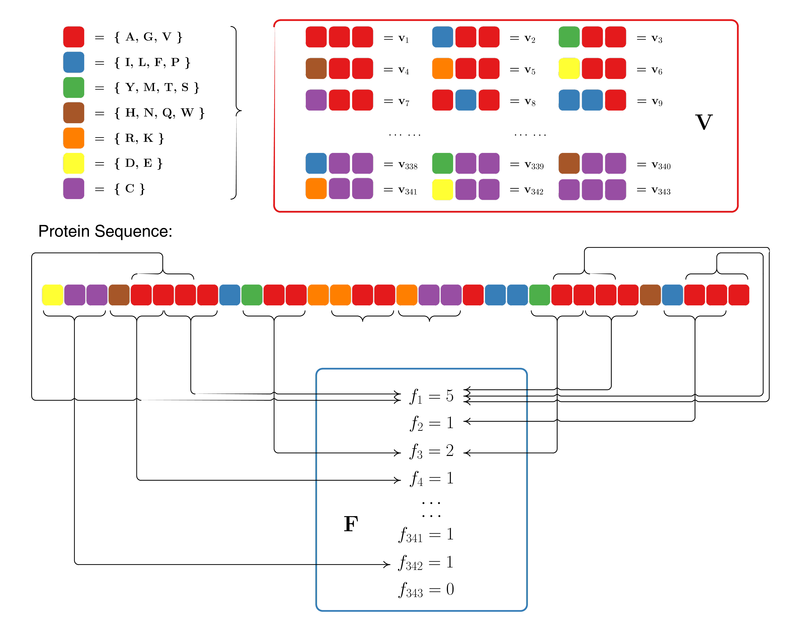
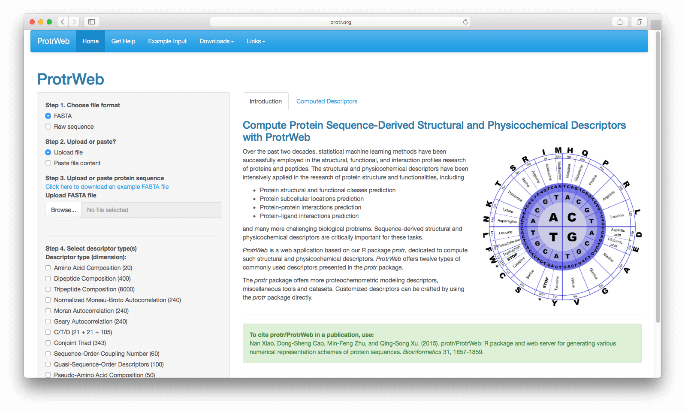

# Introduction

The protr package offers a unique and comprehensive toolkit
for generating various numerical representation schemes of protein
sequences. The descriptors included are extensively utilized in
bioinformatics and chemogenomics research. The commonly used
descriptors listed in protr include amino acid composition,
autocorrelation, CTD, conjoint traid, quasi-sequence order,
pseudo amino acid composition, and profile-based descriptors
derived by Position-Specific Scoring Matrix (PSSM).
The descriptors for proteochemometric (PCM) modeling, includes the
scales-based descriptors derived by principal components analysis,
factor analysis, multidimensional scaling, amino acid properties
(AAindex), 20+ classes of 2D and 3D molecular descriptors
(Topological, WHIM, VHSE, etc.), and BLOSUM/PAM matrix-derived descriptors.
The protr package also integrates the function of parallelized
similarity computation derived by pairwise protein sequence alignment
and Gene Ontology (GO) semantic similarity measures. ProtrWeb,
the web application built on protr, can be accessed from http://protr.org.

If you find protr is useful in your research, please feel free
to cite our paper:

<blockquote>
Nan Xiao, Dong-Sheng Cao, Min-Feng Zhu, and Qing-Song Xu. (2015). protr/ProtrWeb: R package and web server for generating various numerical representation schemes of protein sequences. _Bioinformatics_ 31 (11), 1857-1859.
</blockquote>

BibTeX entry:

```bibtex
@article{Xiao2015,
author = {Xiao, Nan and Cao, Dong-Sheng and Zhu, Min-Feng and Xu, Qing-Song.},
title = {{protr/ProtrWeb: R package and web server for generating
  various numerical representation schemes of protein sequences}},
journal = {Bioinformatics},
year = {2015},
volume = {31},
number = {11},
pages = {1857--1859},
doi = {10.1093/bioinformatics/btv042},
issn = {1367-4803},
url = {http://bioinformatics.oxfordjournals.org/content/31/11/1857}
}
```

# An Example Workflow

Here we use the subcellular localization dataset of human proteins presented
in @chou2008cell to demonstrate the workflow of using protr.

The complete dataset includes 3,134 protein sequences (2,750 different
proteins), classified into 14 human subcellular locations. We selected
two classes of proteins as our benchmark dataset. Class 1 contains 325
_extracell_ proteins, and class 2 includes 307 _mitochondrion_
proteins. Here we aim to build a random forest classification model
to classify these two types of proteins.

First, we load the protr package, then read the protein sequences
stored in two separated FASTA files with `readFASTA()`:

```{r}
library("protr")

# load FASTA files
extracell = readFASTA(system.file(
  "protseq/extracell.fasta", package = "protr"))
mitonchon = readFASTA(system.file(
  "protseq/mitochondrion.fasta", package = "protr"))
```

To read protein sequences stored in PDB format files, use `readPDB()` instead.
The loaded sequences will be stored as two lists in R, and each
component in the list is a character string representing one protein sequence.
In this case, there are 325 _extracell_ protein sequences and
306 _mitonchon_ protein sequences:

```{r, eval = FALSE}
length(extracell)
```

```{r, eval = FALSE}
## [1] 325
```

```{r, eval = FALSE}
length(mitonchon)
```

```{r, eval = FALSE}
## [1] 306
```

To ensure that the protein sequences only have the 20 standard amino acid
types which is usually required for the descriptor computation, we use the
`protcheck()` function to do the amino acid type sanity check and
remove the _non-standard_ sequences:

```{r, eval = FALSE}
extracell = extracell[(sapply(extracell, protcheck))]
mitonchon = mitonchon[(sapply(mitonchon, protcheck))]
```

```{r, eval = FALSE}
length(extracell)
```

```{r, eval = FALSE}
## [1] 323
```

```{r, eval = FALSE}
length(mitonchon)
```

```{r, eval = FALSE}
## [1] 304
```

Two protein sequences were removed from each class.
For the remaining sequences, we calculate the Type II PseAAC descriptor,
i.e., the amphiphilic pseudo amino acid composition (APseAAC) descriptor
[@chouapaac] and make class labels for classification modeling.

```{r, eval = FALSE}
# calculate APseAAC descriptors
x1 = t(sapply(extracell, extractAPAAC))
x2 = t(sapply(mitonchon, extractAPAAC))
x  = rbind(x1, x2)

# make class labels
labels = as.factor(c(rep(0, length(extracell)), rep(1, length(mitonchon))))
```

In protr, the functions of commonly used descriptors for protein
sequences and proteochemometric (PCM) modeling descriptors are named
after `extract...()`.

Next, we will split the data into a 75% training set and a 25% test set.

```{r, eval = FALSE}
set.seed(1001)

# split training and test set
tr.idx = c(
  sample(1:nrow(x1), round(nrow(x1) * 0.75)),
  sample(nrow(x1) + 1:nrow(x2), round(nrow(x2) * 0.75))
)
te.idx = setdiff(1:nrow(x), tr.idx)

x.tr = x[tr.idx, ]
x.te = x[te.idx, ]
y.tr = labels[tr.idx]
y.te = labels[te.idx]
```

We will train a random forest classification model on the training set
with 5-fold cross-validation, using the `randomForest` package.

```{r, eval = FALSE}
library("randomForest")
rf.fit = randomForest(x.tr, y.tr, cv.fold = 5)
print(rf.fit)
```

The training result is:

```{r, eval = FALSE}
## Call:
##  randomForest(x = x.tr, y = y.tr, cv.fold = 5)
##                Type of random forest: classification
##                      Number of trees: 500
## No. of variables tried at each split: 8
##
##         OOB estimate of  error rate: 25.11%
## Confusion matrix:
##     0   1 class.error
## 0 196  46   0.1900826
## 1  72 156   0.3157895
```

With the model trained on the training set, we predict on the test set
and plot the ROC curve with the `pROC` package, as is shown
in Figure 1.

```{r, eval = FALSE}
# predict on test set
rf.pred = predict(rf.fit, newdata = x.te, type = "prob")[, 1]

# plot ROC curve
library("pROC")
plot.roc(y.te, rf.pred, grid = TRUE, print.auc = TRUE)
```

The area under the ROC curve (AUC) is:

```{r, eval = FALSE}
## Call:
## plot.roc.default(x = y.te, predictor = rf.pred, col = "#0080ff",
##                  grid = TRUE, print.auc = TRUE)
##
## Data: rf.pred in 81 controls (y.te 0) > 76 cases (y.te 1).
## Area under the curve: 0.8697
```


<p align="center">Figure 1: ROC curve for the test set of protein subcellular localization data</p>

# Package Overview

The protr package [@Xiao2015] implemented most of the
state-of-the-art protein sequence descriptors with R.
Generally, each type of the descriptors (features) can be calculated
with a function named `extractX()` in the protr package,
where `X` stands for the abbrevation of the descriptor name.
The descriptors and the function names implemented are listed below:


- Amino acid composition

    - `extractAAC()` - Amino acid composition
    - `extractDC()` - Dipeptide composition
    - `extractTC()` - Tripeptide composition

- Autocorrelation

    - `extractMoreauBroto()` - Normalized Moreau-Broto autocorrelation
    - `extractMoran()` - Moran autocorrelation
    - `extractGeary()` - Geary autocorrelation

- CTD descriptors

    - `extractCTDC()` - Composition
    - `extractCTDT()` - Transition
    - `extractCTDD()` - Distribution

- Conjoint triad descriptors

    - `extractCTriad()` - Conjoint triad descriptors

- Quasi-sequence-order descriptors

    - `extractSOCN()` - Sequence-order-coupling number
    - `extractQSO()` - Quasi-sequence-order descriptors

- Pseudo-amino acid composition

    - `extractPAAC()` - Pseudo-amino acid composition (PseAAC)
    - `extractAPAAC()` - Amphiphilic pseudo-amino acid composition (APseAAC)

- Profile-based descriptors

    - `extractPSSM()`
    - `extractPSSMAcc()`
    - `extractPSSMFeature()`

The descriptors commonly used in Proteochemometric Modeling (PCM)
implemented in protr include:


- `extractScales()`, `extractScalesGap()` - Scales-based descriptors derived by Principal Components Analysis

    - `extractProtFP()`, `extractProtFPGap()` - Scales-based descriptors derived by amino acid properties from AAindex (a.k.a. _Protein Fingerprint_)
    - `extractDescScales()` - Scales-based descriptors derived by 20+ classes of 2D and 3D molecular descriptors (Topological, WHIM, VHSE, etc.)

- `extractFAScales()` - Scales-based descriptors derived by Factor Analysis
- `extractMDSScales()` - Scales-based descriptors derived by Multidimensional Scaling
- `extractBLOSUM()` - BLOSUM and PAM matrix-derived descriptors

The protr package integrates the function of parallelized similarity score
computation derived by local or global protein sequence alignment between
a list of protein sequences, the sequence alignment computation is
provided by `Biostrings`, the corresponding functions listed in the
`protr` package include:

- `twoSeqSim()` - Similarity calculation derived by sequence alignment
  between two protein sequences
- `parSeqSim()` - Parallelized pairwise similarity calculation with a
  list of protein sequences

The protr package also integrates the function of parallelized similarity
score computation derived by Gene Ontology (GO) semantic similarity measures
between a list of GO terms / Entrez Gene IDs, the GO similarity computation
is provided by `GOSemSim`, the corresponding functions listed
in the protr package include:

- `twoGOSim()` - Similarity calculation derived by GO-terms
  semantic similarity measures between two GO terms / Entrez Gene IDs;
- `parGOSim()` - Pairwise similarity calculation with a
  list of GO terms / Entrez Gene IDs.

To use the `parSeqSim()` function, we suggest the users to install
the packages `foreach` and `doParallel` first, in order to make
the parallelized pairwise similarity computation available.

In the following sections, we will introduce the descriptors and function
usage in this order.

# Commonly Used Descriptors

**Note**: Users need to intelligently evaluate the underlying details
of the descriptors provided, instead of using protr with their data blindly,
especially for the descriptor types with more flexibility.
It would be wise for the users to use some negative and positive control
comparisons where relevant to help guide interpretation of the results.

A protein or peptide sequence with $N$ amino acid residues can be generally
represented as $\{\,R_1, R_2, \ldots, R_n\,\}$, where $R_i$ represents the
residue at the $i$-th position in the sequence. The labels $i$ and $j$ are
used to index amino acid position in a sequence, and $r$, $s$, $t$ are used
to represent the amino acid type. The computed descriptors are roughly
categorized into 4 groups according to their major applications.

A protein sequence can be partitioned equally into segments.
The descriptors designed for the complete sequence, can be often
applied to each individual segment.

## Amino Acid Composition Descriptor

The amino acid composition describes the fraction of each amino acid type
within a protein sequence. The fractions of all 20 natural amino acids
are calculated as:

$$
f(r) = \frac{N_r}{N} \quad r = 1, 2, \ldots, 20.
$$
where $N_r$ is the number of the amino acid type $r$ and $N$ is the length
of the sequence.

As was described above, we can use the function `extractAAC()` to
extract the descriptors (features) from protein sequences:

```{r, extractAAC}
library("protr")

x = readFASTA(system.file(
  "protseq/P00750.fasta", package = "protr"))[[1]]

extractAAC(x)
```

Here, with the function `readFASTA()` we loaded a single protein sequence
(P00750, Tissue-type plasminogen activator) from a FASTA format file.
Then extracted the AAC descriptors with `extractAAC()`.
The result returned is a named vector, whose elements are tagged
with the name of each amino acid.

## Dipeptide Composition Descriptor

Dipeptide composition gives a 400-dimensional descriptor, defined as:

$$
f(r, s) = \frac{N_{rs}}{N - 1} \quad r, s = 1, 2, \ldots, 20.
$$

where $N_{rs}$ is the number of dipeptide represented by amino acid
type $r$ and type $s$. Similar to `extractAAC()`,
here we use `extractDC()` to compute the descriptors:

```{r, extractDC}
dc = extractDC(x)
head(dc, n = 30L)
```

Here we only showed the first 30 elements of the result vector and omitted
the rest of the result. The element names of the returned vector are
self-explanatory as before.

## Tripeptide Composition Descriptor

Tripeptide composition gives a 8000-dimensional descriptor, defined as:

$$
f(r, s, t) = \frac{N_{rst}}{N - 2} \quad r, s, t = 1, 2, \ldots, 20
$$

where $N_{rst}$ is the number of tripeptides represented by amino acid type
$r$, $s$, and $t$. With function `extractTC()`, we can easily obtain
the length-8000 descriptor, to save some space, here we also omitted
the long outputs:

```{r, extractTC}
tc = extractTC(x)
head(tc, n = 36L)
```

## Autocorrelation Descriptors

Autocorrelation descriptors are defined based on the distribution of amino
acid properties along the sequence. The amino acid properties used here are
various types of amino acids index (Retrieved from the
[AAindex Database](http://www.genome.jp/dbget/aaindex.html),
see @aaindex1999, @aaindex2000, and @aaindex2008; see Figure 2
for an illustrated example). Three types of autocorrelation
descriptors are defined here and described below.

All the amino acid indices are centralized and standardized before
the calculation, i.e.

$$
P_r = \frac{P_r - \bar{P}}{\sigma}
$$

where $\bar{P}$ is the average of the property of the 20 amino acids:

$$
\bar{P} = \frac{\sum_{r=1}^{20} P_r}{20} \quad \textrm{and} \quad \sigma = \sqrt{\frac{1}{2} \sum_{r=1}^{20} (P_r - \bar{P})^2}
$$


<p align="center">Figure 2: An illustrated example in the AAIndex database</p>

### Normalized Moreau-Broto autocorrelation descriptors

For protein sequences, the Moreau-Broto autocorrelation descriptors
can be defined as:

$$
AC(d) = \sum_{i=1}^{N-d} P_i P_{i + d} \quad d = 1, 2, \ldots, \textrm{nlag}
$$

where $d$ is called the lag of the autocorrelation; $P_i$ and $P_{i+d}$
are the properties of the amino acids at position $i$ and $i+d$;
$\textrm{nlag}$ is the maximum value of the lag.

The normalized Moreau-Broto autocorrelation descriptors are defined as:

$$
ATS(d) = \frac{AC(d)}{N-d} \quad d = 1, 2, \ldots, \textrm{nlag}
$$

The corresponding function for this descriptor is `extractMoreauBroto()`.
A typical call would be:

```{r, extractMoreau1}
moreau = extractMoreauBroto(x)
head(moreau, n = 36L)
```

The eight default properties used here are:

- AccNo. CIDH920105 - Normalized Average Hydrophobicity Scales
- AccNo. BHAR880101 - Average Flexibility Indices
- AccNo. CHAM820101 - Polarizability Parameter
- AccNo. CHAM820102 - Free Energy of Solution in Water, kcal/mole
- AccNo. CHOC760101 - Residue Accessible Surface Area in Tripeptide
- AccNo. BIGC670101 - Residue Volume
- AccNo. CHAM810101 - Steric Parameter
- AccNo. DAYM780201 - Relative Mutability

Users can change the property names of AAindex database with the argument
`props`. The AAindex data shipped with protr can be loaded by
`data(AAindex)`, which has the detailed information of each property.
With the argument `customprops` and `nlag`, users can specify
their own properties and lag value to calculate with. For example:

```{r, extractMoreau2}
# Define 3 custom properties
myprops = data.frame(
  AccNo = c("MyProp1", "MyProp2", "MyProp3"),
  A = c(0.62,  -0.5, 15),  R = c(-2.53,   3, 101),
  N = c(-0.78,  0.2, 58),  D = c(-0.9,    3, 59),
  C = c(0.29,    -1, 47),  E = c(-0.74,   3, 73),
  Q = c(-0.85,  0.2, 72),  G = c(0.48,    0, 1),
  H = c(-0.4,  -0.5, 82),  I = c(1.38, -1.8, 57),
  L = c(1.06,  -1.8, 57),  K = c(-1.5,    3, 73),
  M = c(0.64,  -1.3, 75),  F = c(1.19, -2.5, 91),
  P = c(0.12,     0, 42),  S = c(-0.18, 0.3, 31),
  T = c(-0.05, -0.4, 45),  W = c(0.81, -3.4, 130),
  Y = c(0.26,  -2.3, 107), V = c(1.08, -1.5, 43)
)

# Use 4 properties in the AAindex database, and 3 cutomized properties
moreau2 = extractMoreauBroto(
  x, customprops = myprops,
  props = c(
    "CIDH920105", "BHAR880101",
    "CHAM820101", "CHAM820102",
    "MyProp1", "MyProp2", "MyProp3"))

head(moreau2, n = 36L)
```

About the standard input format of `props` and `customprops`,
see `?extractMoreauBroto` for details.

### Moran autocorrelation descriptors

For protein sequences, the Moran autocorrelation descriptors can be defined as:

$$
I(d) = \frac{\frac{1}{N-d} \sum_{i=1}^{N-d} (P_i - \bar{P}') (P_{i+d} - \bar{P}')}{\frac{1}{N} \sum_{i=1}^{N} (P_i - \bar{P}')^2} \quad d = 1, 2, \ldots, 30
$$

where $d$, $P_i$, and $P_{i+d}$ are defined in the same way as in
the first place; $\bar{P}'$ is the considered property $P$ along
the sequence, i.e.,

$$
\bar{P}' = \frac{\sum_{i=1}^N P_i}{N}
$$

$d$, $P$, $P_i$ and $P_{i+d}$, $\textrm{nlag}$ have the same meaning as above.

With `extractMoran()` (which has the identical parameters as
`extractMoreauBroto()`), we can compute the Moran autocorrelation
descriptors (only print out the first 36 elements):

```{r, extractMoran}
# Use the 3 custom properties defined before
# and 4 properties in the AAindex database
moran = extractMoran(
  x, customprops = myprops,
  props = c(
    "CIDH920105", "BHAR880101",
    "CHAM820101", "CHAM820102",
    "MyProp1", "MyProp2", "MyProp3"))

head(moran, n = 36L)
```

### Geary autocorrelation descriptors

Geary autocorrelation descriptors for protein sequences can be defined as:

$$
C(d) = \frac{\frac{1}{2(N-d)} \sum_{i=1}^{N-d} (P_i - P_{i+d})^2}{\frac{1}{N-1} \sum_{i=1}^{N} (P_i - \bar{P}')^2} \quad d = 1, 2, \ldots, 30
$$

where $d$, $P$, $P_i$, $P_{i+d}$, and $\textrm{nlag}$ have the same
meaning as above.

For each amino acid index, there will be $3 \times \textrm{nlag}$
autocorrelation descriptors. The usage of `extractGeary()` is
exactly the same as `extractMoreauBroto()` and `extractMoran()`:

```{r, extractGeary}
# Use the 3 custom properties defined before
# and 4 properties in the AAindex database
geary = extractGeary(
  x, customprops = myprops,
  props = c(
    "CIDH920105", "BHAR880101",
    "CHAM820101", "CHAM820102",
    "MyProp1", "MyProp2", "MyProp3"))

head(geary, n = 36L)
```

## Composition/Transition/Distribution

The CTD descriptors are developed by @dubchak1 and @dubchak2.


<p align="left">Figure 3: The sequence of a hypothetic protein indicating
the construction of composition, transition, and distribution descriptors
of a protein. Sequence index indicates the position of an amino acid in
the sequence. The index for each type of amino acids in the sequence
(`1`, `2` or `3`) indicates the position of the first, second, third,
... of that type of amino acid. 1/2 transition indicates the position
of `12` or `21` pairs in the sequence (1/3 and 2/3 are defined
in the same way).</p>

**Step 1: Sequence Encoding**

The amino acids are categorized into three classes according to its attribute,
and each amino acid is encoded by one of the indices 1, 2, 3 according to which
class it belongs. The attributes used here include hydrophobicity,
normalized van der Waals volume, polarity, and polarizability.
The corresponding classification for each attribute is listed in Table 1.

                                    **Group 1**              **Group 2**                                      **Group 3**
  --------------------------------- ------------------------ ------------------------------------------------ ---------------------
  Hydrophobicity                    Polar                    Neutral                                          Hydrophobicity
                                    R, K, E, D, Q, N         G, A, S, T, P, H, Y                              C, L, V, I, M, F, W
  Normalized van der Waals Volume   0-2.78                   2.95-4.0                                         4.03-8.08
                                    G, A, S, T, P, D, C      N, V, E, Q, I, L                                 M, H, K, F, R, Y, W
  Polarity                          4.9-6.2                  8.0-9.2                                          10.4-13.0
                                    L, I, F, W, C, M, V, Y   P, A, T, G, S                                    H, Q, R, K, N, E, D
  Polarizability                    0-1.08                   0.128-0.186                                      0.219-0.409
                                    G, A, S, D, T            C, P, N, V, E, Q, I, L                           K, M, H, F, R, Y, W
  Charge                            Positive                 Neutral                                          Negative
                                    K, R                     A, N, C, Q, G, H, I, L, M, F, P, S, T, W, Y, V   D, E
  Secondary Structure               Helix                    Strand                                           Coil
                                    E, A, L, M, Q, K, R, H   V, I, Y, C, W, F, T                              G, N, P, S, D
  Solvent Accessibility             Buried                   Exposed                                          Intermediate
                                    A, L, F, C, G, I, V, W   R, K, Q, E, N, D                                 M, S, P, T, H, Y

  : Table 1: Amino acid attributes, and the three-group classification of
  the 20 amino acids by each attribute

For example, for a given sequence `MTEITAAMVKELRESTGAGA`, it will be
encoded as `32132223311311222222` according to its hydrophobicity.

**Step 2: Compute Composition, Transition, and Distribution Descriptors**

Three types of descriptors, _Composition_ (_C_), _Transition_ (_T_),
and _Distribution_ (_D_) can be calculated for a given attribute as follows.

### Composition

Composition is defined as the global percentage for each encoded class
in the protein sequence. In the above example using the hydrophobicity
classification, the numbers for encoded classes `1`, `2`, `3` are 5, 10, and 5,
so that the compositions for them will be $5/20=25\%$, $10/20=10\%$,
and $5/20=25\%$, where 20 is the length of the protein sequence.
The composition descriptor can be expressed as

$$
C_r = \frac{n_r}{n} \quad r = 1, 2, 3
$$

where $n_r$ is the number of amino acid type $r$ in the encoded
sequence; $N$ is the length of the sequence.
An example for `extractCTDC()`:

```{r, extractCTDC}
extractCTDC(x)
```

The result shows the elements who are named as `PropertyNumber.GroupNumber`
in the returned vector.

### Transition

A transition from class 1 to 2 is the percent frequency with which 1 is
followed by 2 or 2 is followed by 1 in the encoded sequences.
The transition descriptor can be computed as

$$
T_{rs} = \frac{n_{rs} + n_{sr}}{N - 1} \quad rs = \text{12}, \text{13}, \text{23}
$$

where $n_{rs}$, $n_{sr}$ are the numbers of dipeptide encoded as `rs` and
`sr` in the sequence; $N$ is the length of the sequence.
An example for `extractCTDT()`:

```{r, extractCTDT}
extractCTDT(x)
```

### Distribution

The _distribution_ descriptor describes the distribution of each attribute
in the sequence.

There are five "distribution" descriptors for each attribute and they are
the position percents in the whole sequence for the first residue, 25%
residues, 50% residues, 75% residues, and 100% residues for a certain
encoded class. For example, there are 10 residues encoded
as `2` in the above example, the positions for the first residue `2`,
the 2nd residue `2` (25% * 10 = 2), the 5th `2` residue (50% * 10 = 5),
the 7th `2` (75% * 10 = 7) and the 10th residue `2` (100% * 10)
in the encoded sequence are 2, 5, 15, 17, 20, so that
the distribution descriptors for `2` are: 10.0 (2/20 * 100),
25.0 (5/20 * 100), 75.0 (15/20 * 100), 85.0 (17/20 * 100),
100.0 (20/20 * 100).

To compute the distribution descriptor, use `extractCTDD()`:

```{r, extractCTDD}
extractCTDD(x)
```

## Conjoint Triad Descriptors

Conjoint triad descriptors are proposed by @shenjw.
The conjoint triad descriptors were used to model protein-protein
interactions based on the classification of amino acids. In this approach,
each protein sequence is represented by a vector space consisting of
descriptors of amino acids. To reduce the dimensions of vector space,
the 20 amino acids were clustered into several classes according to
their dipoles and volumes of the side chains. The conjoint triad
descriptors are calculated as follows:

**Step 1: Classification of Amino Acids**

Electrostatic and hydrophobic interactions dominate protein-protein
interactions. These two kinds of interactions may be reflected by
the dipoles and volumes of the side chains of amino acids, respectively.
Accordingly, these two parameters were calculated by using the
density-functional theory method B3LYP/6-31G and molecular
modeling approach. Based on the dipoles and volumes of the side chains,
the 20 amino acids can be clustered into seven classes (See Table 2).
Amino acids within the same class likely involve synonymous mutations
because of their similar characteristics.

   No.   Dipole Scale$^1$   Volume Scale$^2$         Class
  ----- ------------------ ------------------ --------------------
    1          $-$                $-$            Ala, Gly, Val
    2          $-$                $+$          Ile, Leu, Phe, Pro
    3          $+$                $+$          Tyr, Met, Thr, Ser
    4          $++$               $+$          His, Asn, Gln, Tpr
    5         $+++$               $+$               Arg, Lys
    6        $+'+'+'$             $+$               Asp, Glu
    7         $+^3$               $+$                 Cys

  : Table 2: Classification of amino acids based on dipoles and volumes of the
  side chains

<p align="left"><sup>1</sup> Dipole Scale (Debye): $-$, Dipole < 1.0;
$+$, 1.0 < Dipole < 2.0; $++$, 2.0 < Dipole < 3.0; $+++$, Dipole > 3.0;
$+'+'+'$, Dipole > 3.0 with opposite orientation.</p>
<p align="left"><sup>2</sup> Volume Scale
($\overset{\lower.5em\circ}{\mathrm{A}}\lower.01em^3$):
$-$, Volume < 50; $+$, Volume > 50.</p>
<p align="left"><sup>3</sup> Cys is separated from class 3
because of its ability to form disulfide bonds.</p>

**Step 2: Conjoint Triad Calculation**

The conjoint triad descriptors considered the properties of one amino acid
and its vicinal amino acids and regarded any three continuous amino acids
as a unit. Thus, the triads can be differentiated according to the classes
of amino acids, i.e., triads composed by three amino acids belonging to
the same classes, such as ART and VKS, can be treated identically.
To conveniently represent a protein, we first use a binary space
$(\mathbf{V}, \mathbf{F})$ to represent a protein sequence. Here,
$\mathbf{V}$ is the vector space of the sequence features, and
each feature $v_i$ represents a sort of triad type; $\mathbf{F}$
is the frequency vector corresponding to $\mathbf{V}$, and the value
of the $i$-th dimension of $\mathbf{F} (f_i)$ is the frequency of type
$v_i$ appearing in the protein sequence. For the amino acids that have
been catogorized into seven classes, the size of $\mathbf{V}$ should be
$7 \times 7 \times 7$; thus $i = 1, 2, \ldots, 343$. The detailed
description for ($\mathbf{V}$, $\mathbf{F}$) is illustrated
in Figure 4.


<p align="left">Figure 4: Schematic diagram for constructing the
vector space ($\mathbf{V}$, $\mathbf{F}$) of protein sequences.
$\mathbf{V}$ is the vector space of the sequence features;
each feature ($v_i$) represents a triad composed of three
consecutive amino acids; $\mathbf{F}$ is the frequency vector
corresponding to $\mathbf{V}$, and the value of the $i$-th
dimension of $\mathbf{F} (f_i)$ is the frequency that $v_i$
triad appeared in the protein sequence.</p>

Clearly, each protein correlates to the length (number of amino acids)
of protein. In general, a long protein would have a large value of $f_i$,
which complicates the comparison between two heterogeneous proteins.
Thus, we defined a new parameter, $d_i$, by normalizing $f_i$ with the
following equation:

$$
d_i = \frac{f_i - \min\{\,f_1, f_2 , \ldots, f_{343}\,\}}{\max\{\,f_1, f_2, \ldots, f_{343}\,\}}
$$

The numerical value of $d_i$ of each protein ranges from 0 to 1, which
thereby enables the comparison between proteins. Accordingly, we obtain
another vector space (designated $\mathbf{D}$) consisting of $d_i$ to
represent protein.

To compute conjoint triads of protein sequences, we can simply use:

```{r, extractCTriad}
ctriad = extractCTriad(x)
head(ctriad, n = 65L)
```

by which we only outputted the first 65 of total 343 dimension to save space.

## Quasi-sequence-order Descriptors

The quasi-sequence-order descriptors are proposed by @chouqsoe.
They are derived from the distance matrix between the 20 amino acids.

### Sequence-order-coupling number

The $d$-th rank sequence-order-coupling number is defined as:

$$
\tau_d = \sum_{i=1}^{N-d} (d_{i, i+d})^2 \quad d = 1, 2, \ldots, \textrm{maxlag}
$$

where $d_{i, i+d}$ is the distance between the two amino acids at position
$i$ and $i+d$.

**Note**: maxlag is the maximum lag and the length of the protein
must be not less than $\textrm{maxlag}$.

The function `extractSOCN()` is used for computing the
sequence-order-coupling numbers:

```{r, extractSOCN}
extractSOCN(x)
```

Users can also specify the maximum lag value with the `nlag` argument.

**Note**: In addition to Schneider-Wrede physicochemical distance
matrix [@wrede] used by Kuo-Chen Chou, another chemical distance
matrix by @grantham is also used here. So the descriptors dimension
will be `nlag * 2`. The quasi-sequence-order descriptors described
next also utilized the two matrices.

### Quasi-sequence-order descriptors

For each amino acid type, a quasi-sequence-order descriptor can be defined as:

$$
X_r = \frac{f_r}{\sum_{r=1}^{20} f_r + w \sum_{d=1}^{\textrm{maxlag}} \tau_d} \quad r = 1, 2, \ldots, 20
$$

where $f_r$ is the normalized occurrence for amino acid type $i$ and $w$
is a weighting factor ($w=0.1$). These are the first 20 quasi-sequence-order
descriptors. The other 30 quasi-sequence-order are defined as:

$$
X_d = \frac{w \tau_{d-20}}{\sum_{r=1}^{20} f_r + w \sum_{d=1}^{\textrm{maxlag}} \tau_d} \quad d = 21, 22, \ldots, 20 + \textrm{maxlag}
$$


<p align="left">Figure 5: A schematic drawing to show (a) the 1st-rank, (b) the 2nd-rank, and (3) the 3rd-rank sequence-order-coupling mode along a protein sequence. (a) Reflects the coupling mode between all the most contiguous residues, (b) that between all the 2nd most contiguous residues, and (c) that between all the 3rd most contiguous residues. This figure is from @chouqsoe.</p>

A minimal example for `extractQSO()`:

```{r, extractQSO}
extractQSO(x)
```

where users can also specify the maximum lag with the argument `nlag`
and the weighting factor with the argument `w`.

## Pseudo-Amino Acid Composition (PseAAC)

This group of descriptors are proposed by @choupaac. PseAAC descriptors
are also named as the _type 1 pseudo-amino acid composition_. Let $H_1^o (i)$,
$H_2^o (i)$, $M^o (i)$ ($i=1, 2, 3, \ldots, 20$) be the original hydrophobicity
values, the original hydrophilicity values and the original side chain masses
of the 20 natural amino acids, respectively. They are converted to following
qualities by a standard conversion:

$$
H_1 (i) = \frac{H_1^o (i) - \frac{1}{20} \sum_{i=1}^{20} H_1^o (i)}{\sqrt{\frac{\sum_{i=1}^{20} [H_1^o (i) - \frac{1}{20} \sum_{i=1}^{20} H_1^o (i) ]^2}{20}}}
$$

$H_2^o (i)$ and $M^o (i)$ are normalized as $H_2 (i)$ and $M (i)$ in the same way.


<p align="left">Figure 6: A schematic drawing to show (a) the first-tier, (b) the second-tier, and (3) the third-tiersequence order correlation mode along a protein sequence. Panel (a) reflects the correlation mode between all the most contiguous residues, panel (b) that between all the second-most contiguous residues, and panel (c) that between all the third-most contiguous residues. This figure is from @choupaac.</p>

Then, a correlation function can be defines as

$$
\Theta (R_i, R_j) = \frac{1}{3} \bigg\{ [ H_1 (R_i) - H_1 (R_j) ]^2 + [ H_2 (R_i) - H_2 (R_j) ]^2 + [ M (R_i) - M (R_j) ]^2 \bigg\}
$$

This correlation function is actually an average value for the three amino
acid properties: hydrophobicity value, hydrophilicity value and side chain
mass. Therefore, we can extend this definition of correlation functions for
one amino acid property or for a set of $n$ amino acid properties.

For one amino acid property, the correlation can be defined as:

$$
\Theta (R_i, R_j) = [H_1 (R_i) - H_1(R_j)]^2
$$

where $H (R_i)$ is the amino acid property of amino acid $R_i$ after
standardization.

For a set of n amino acid properties, it can be defined as: where $H_k (R_i)$
is the $k$-th property in the amino acid property set for amino acid $R_i$.

$$
\Theta (R_i, R_j) = \frac{1}{n} \sum_{k=1}^{n} [H_k (R_i) - H_k (R_j)]^2
$$

where $H_k(R_i)$ is the $k$-th property in the amino acid property set
for amino acid $R_i$.

A set of descriptors named sequence order-correlated factors are defined as:

\begin{align*}
\theta_1  & = \frac{1}{N-1} \sum_{i=1}^{N-1} \Theta (R_i, R_{i+1})\\
\theta_2  & = \frac{1}{N-2} \sum_{i=1}^{N-2} \Theta (R_i, R_{i+2})\\
\theta_3  & = \frac{1}{N-3} \sum_{i=1}^{N-3} \Theta (R_i, R_{i+3})\\
          & \ldots \\
\theta_\lambda  & = \frac{1}{N-\lambda} \sum_{i=1}^{N-\lambda} \Theta (R_i, R_{i+\lambda})
\end{align*}

$\lambda$ ($\lambda < L$) is a parameter to be specified. Let $f_i$ be the
normalized occurrence frequency of the 20 amino acids in the protein
sequence, a set of $20 + \lambda$ descriptors called the pseudo-amino
acid composition for a protein sequence can be defines as:

$$
X_c = \frac{f_c}{\sum_{r=1}^{20} f_r + w \sum_{j=1}^{\lambda} \theta_j} \quad (1 < c < 20)
$$

$$
X_c = \frac{w \theta_{c-20}}{\sum_{r=1}^{20} f_r + w \sum_{j=1}^{\lambda} \theta_j} \quad (21 < c < 20 + \lambda)
$$

where $w$ is the weighting factor for the sequence-order effect and is
set to $w = 0.05$ in protr as suggested by Kuo-Chen Chou.

With `extractPAAC()`, we can compute the PseAAC descriptors directly:

```{r, extractPAAC}
extractPAAC(x)
```

The `extractPAAC()` fucntion also provides the additional arguments
`props` and `customprops`, which are similar to those arguments for
Moreau-Broto/Moran/Geary autocorrelation descriptors. For their minor
differences, please see `?extracPAAC`. Users can specify the lambda
parameter and the weighting factor with arguments `lambda` and `w`.

**Note**: In the work of Kuo-Chen Chou, the definition for "normalized
occurrence frequency" was not given. In this work, we define it as the
occurrence frequency of amino acid in the sequence normalized to 100%
and hence our calculated values are not the same as values by them.

## Amphiphilic Pseudo-Amino Acid Composition (APseAAC)

Amphiphilic Pseudo-Amino Acid Composition (APseAAC) was proposed in
@choupaac. APseAAC is also recognized as the _type 2 pseudo-amino
acid composition_. The definitions of these qualities are similar to the
PAAC descriptors. From $H_1 (i)$ and $H_2 (j)$ defined before,
the hydrophobicity and hydrophilicity correlation functions are
defined as:

\begin{align*}
H_{i, j}^1  & = H_1 (i) H_1 (j)\\
H_{i, j}^2  & = H_2 (i) H_2 (j)
\end{align*}

From these qualities, sequence order factors can be defines as:

\begin{align*}
\tau_1  & = \frac{1}{N-1} \sum_{i=1}^{N-1} H_{i, i+1}^1\\
\tau_2  & = \frac{1}{N-1} \sum_{i=1}^{N-1} H_{i, i+1}^2\\
\tau_3  & = \frac{1}{N-2} \sum_{i=1}^{N-2} H_{i, i+2}^1\\
\tau_4  & = \frac{1}{N-2} \sum_{i=1}^{N-2} H_{i, i+2}^2\\
        & \ldots \\
\tau_{2 \lambda - 1} & = \frac{1}{N-\lambda} \sum_{i=1}^{N-\lambda} H_{i, i+\lambda}^1\\
\tau_{2 \lambda}     & = \frac{1}{N-\lambda} \sum_{i=1}^{N-\lambda} H_{i, i+\lambda}^2
\end{align*}


<p align="left">Figure 7: A schematic diagram to show (**a1**/**a2**) the first-rank, (**b1**/**b2**) the second-rank and (**c1**/**c2**) the third-rank sequence-order-coupling mode along a protein sequence through a hydrophobicity/hydrophilicity correlation function, where $H_{i, j}^1$ and $H_{i, j}^2$ are given by Equation (3). Panel (a1/a2) reflects the coupling mode between all the most contiguous residues, panel (b1/b2) that between all the second-most contiguous residues and panel (c1/c2) that between all the third-most contiguous residues.  This figure is from @chouapaac.</p>

Then a set of descriptors called _Amphiphilic Pseudo-Amino Acid Composition_ (_APseAAC_) are defined as:

$$
P_c = \frac{f_c}{\sum_{r=1}^{20} f_r + w \sum_{j=1}^{2 \lambda} \tau_j} \quad (1 < c < 20)
$$

$$
P_c = \frac{w \tau_u}{\sum_{r=1}^{20} f_r + w \sum_{j=1}^{2 \lambda} \tau_j} \quad (21 < u < 20 + 2 \lambda)
$$

where $w$ is the weighting factor. Its default value is set to $w = 0.5$ in protr.

A minimal example for `extracAPAAC()` is:

```{r, extractAPAAC}
extractAPAAC(x)
```

This function has the same arguments as `extractPAAC()`.

## Profile-Based Descriptors

The profile-based descriptors for protein sequences are available in
the protr package. The feature vectors of profile-based methods
were based on the PSSM by running PSI-BLAST, and often show good performance.
See @ye2011assessment and @rangwala2005profile for details.
The functions `extractPSSM()`, `extractPSSMAcc()` and
`extractPSSMFeature()` are used to generate these descriptors.
Users need to install the NCBI-BLAST+ software package first to make
the functions fully functional.

# Descriptors for Proteochemometric Modeling

Proteochemometric (PCM) modeling utilizes statistical modeling techniques
to model ligand-target interaction space. The below descriptors implemented
in protr are extensively used in Proteochemometric modeling.

- Scales-based descriptors derived by Principal Components Analysis

    - Scales-based descriptors derived by Amino Acid Properties from AAindex (Protein Fingerprint)
    - Scales-based descriptors derived by 20+ classes of 2D and 3D molecular descriptors (Topological, WHIM, VHSE, etc.)

- Scales-based descriptors derived by Factor Analysis
- Scales-based descriptors derived by Multidimensional Scaling
- BLOSUM and PAM matrix-derived descriptors

Note that each of the scales-based descriptor functions are freely to combine
with the more than 20 classes of 2D and 3D molecular descriptors to construct
highly customized scales-based descriptors. Of course, these functions are
designed to be flexible enough that users can provide totally self-defined
property matrices to construct scales-based descriptors.

For example, to compute the "topological scales" derived by PCA
(using the first 5 principal components),
one can use `extractDescScales()`:

```{r, extractDescScales}
x = readFASTA(system.file(
  "protseq/P00750.fasta", package = "protr"))[[1]]

descscales = extractDescScales(
  x, propmat = "AATopo",
  index = c(37:41, 43:47),
  pc = 5, lag = 7, silent = FALSE)
```

the argument `propmat` involkes the `AATopo` dataset shipped with the
protr package, and the argument `index` selects the 37 to 41 and the
43 to 47 columns (molecular descriptors) in the `AATopo` dataset to use,
the parameter `lag` was set for the Auto Cross Covariance (ACC) for
generating scales-based descriptors of the same length. At last,
we printed the summary of the first 5 principal components (standard
deviation, proportion of variance, cumulative proportion of variance).

The result is a length 175 named vector, which is consistent with the
descriptors before:

```{r, extractDescScales2}
length(descscales)
head(descscales, 15)
```

For another example, to compute the descriptors derived by
the BLOSUM62 matrix and use the first 5 scales, one can use:

```{r, extractBLOSUM}
x = readFASTA(system.file(
  "protseq/P00750.fasta", package = "protr"))[[1]]

blosum = extractBLOSUM(
  x, submat = "AABLOSUM62",
  k = 5, lag = 7, scale = TRUE, silent = FALSE)
```

The result is a length 175 named vector:

```{r, extractBLOSUM2}
length(blosum)
head(blosum, 15)
```

**Dealing with gaps.** In proteochemometrics, (sequence alignment)
gaps can be very useful, since a gap in a certain position contains information.
The protr package has built-in support for such gaps. We deal with
the gaps by using a dummy descriptor to code for the 21st type
of amino acid. The function `extractScalesGap()` and `extractProtFPGap()`
can be used to deal with such gaps. See `?extractScalesGap` and
`?extractProtFPGap` for details.

# Similarity Calculation by Sequence Alignment

Similarity computation derived by local or global protein sequence alignment
between a list of protein sequences is of great need in protein research.
However, this type of pairwise similarity computation often computationally
intensive, especially when there exists many protein sequences.
Luckily, this process is also highly parallelizable, the protr package
integrates the function of parallelized similarity computation derived
by local or global protein sequence alignment between a list of protein sequences.

The function `twoSeqSim()` calculates the alignment result between
two protein sequences. The function `parSeqSim()` calculates
the pairwise similarity calculation with a list of protein
sequences in parallel:

```{r, eval = FALSE}
s1 = readFASTA(system.file("protseq/P00750.fasta", package = "protr"))[[1]]
s2 = readFASTA(system.file("protseq/P08218.fasta", package = "protr"))[[1]]
s3 = readFASTA(system.file("protseq/P10323.fasta", package = "protr"))[[1]]
s4 = readFASTA(system.file("protseq/P20160.fasta", package = "protr"))[[1]]
s5 = readFASTA(system.file("protseq/Q9NZP8.fasta", package = "protr"))[[1]]
plist = list(s1, s2, s3, s4, s5)
psimmat = parSeqSim(plist, cores = 4, type = "local", submat = "BLOSUM62")
print(psimmat)
```

```{r, eval = FALSE}
##            [,1]       [,2]       [,3]       [,4]       [,5]
## [1,] 1.00000000 0.11825938 0.10236985 0.04921696 0.03943488
## [2,] 0.11825938 1.00000000 0.18858241 0.12124217 0.06391103
## [3,] 0.10236985 0.18858241 1.00000000 0.05819984 0.06175942
## [4,] 0.04921696 0.12124217 0.05819984 1.00000000 0.05714638
## [5,] 0.03943488 0.06391103 0.06175942 0.05714638 1.00000000
```

We should note that for a small number of proteins, calculating their
pairwise similarity scores derived by sequence alignment in parallel may
not significantly reduce the overall computation time, since each of the
task only requires a relatively small time to finish, thus, computational
overheads may exist and affect the performance. In testing, we used about
1,000 protein sequences on 64 CPU cores, and observed significant
performance improvement comparing to the sequential computation.

Users should install the packages `foreach` and `doParallel` before
using `parSeqSim()`, according to their operation system.
The protr package will automatically decide which backend to use.

# Similarity Calculation by GO Semantic Similarity Measures

The protr package also integrates the function of similarity score
computation derived by Gene Ontology (GO) semantic similarity measures
between a list of GO terms or Entrez Gene IDs.

The function `twoGOSim()` calculates the similarity derived by GO-terms
semantic similarity measures between two GO terms / Entrez Gene IDs, and the
function `parGOSim()` calculates the pairwise similarity with a list
of GO terms / Entrez Gene IDs:

```{r, eval = FALSE}
# by GO Terms
go1 = c("GO:0005215", "GO:0005488", "GO:0005515",
        "GO:0005625", "GO:0005802", "GO:0005905")  # AP4B1
go2 = c("GO:0005515", "GO:0005634", "GO:0005681",
        "GO:0008380", "GO:0031202")                # BCAS2
go3 = c("GO:0003735", "GO:0005622", "GO:0005840",
        "GO:0006412")                              # PDE4DIP
glist = list(go1, go2, go3)
gsimmat1 = parGOSim(glist, type = "go", ont = "CC")
print(gsimmat1)
```

```{r, eval = FALSE}
##       [,1]  [,2]  [,3]
## [1,] 1.000 0.077 0.055
## [2,] 0.077 1.000 0.220
## [3,] 0.055 0.220 1.000
```

```{r, eval = FALSE}
# by Entrez gene id
genelist = list(c("150", "151", "152", "1814", "1815", "1816"))
gsimmat2 = parGOSim(genelist, type = "gene")
print(gsimmat2)
```

```{r, eval = FALSE}
##        150   151   152  1814  1815  1816
## 150  0.689 0.335 0.487 0.133 0.169 0.160
## 151  0.335 0.605 0.441 0.171 0.198 0.274
## 152  0.487 0.441 0.591 0.151 0.178 0.198
## 1814 0.133 0.171 0.151 0.512 0.401 0.411
## 1815 0.169 0.198 0.178 0.401 0.619 0.481
## 1816 0.160 0.274 0.198 0.411 0.481 0.819
```

# Miscellaneous Tools

In this section, we will briefly introduce some useful tools provided by the protr package.

## Retrieve Protein Sequences from UniProt

This function `getUniProt()` gets protein sequences from uniprot.org
by protein ID(s). The input `ID` is a character vector specifying
the protein ID(s). The returned sequences are stored in a list:

```{r, eval = FALSE}
ids = c("P00750", "P00751", "P00752")
prots = getUniProt(ids)
print(prots)
```

```{r, eval = FALSE}
## [[1]]
## [1] "MDAMKRGLCCVLLLCGAVFVSPSQEIHARFRRGARSYQVICRDEKTQMIYQQHQSWLRPVLRSNRVEYCWCN
## SGRAQCHSVPVKSCSEPRCFNGGTCQQALYFSDFVCQCPEGFAGKCCEIDTRATCYEDQGISYRGTWSTAESGAECT
## NWNSSALAQKPYSGRRPDAIRLGLGNHNYCRNPDRDSKPWCYVFKAGKYSSEFCSTPACSEGNSDCYFGNGSAYRGT
## HSLTESGASCLPWNSMILIGKVYTAQNPSAQALGLGKHNYCRNPDGDAKPWCHVLKNRRLTWEYCDVPSCSTCGLRQ
## YSQPQFRIKGGLFADIASHPWQAAIFAKHRRSPGERFLCGGILISSCWILSAAHCFQERFPPHHLTVILGRTYRVVP
## GEEEQKFEVEKYIVHKEFDDDTYDNDIALLQLKSDSSRCAQESSVVRTVCLPPADLQLPDWTECELSGYGKHEALSP
## FYSERLKEAHVRLYPSSRCTSQHLLNRTVTDNMLCAGDTRSGGPQANLHDACQGDSGGPLVCLNDGRMTLVGIISWG
## LGCGQKDVPGVYTKVTNYLDWIRDNMRP"
## 
## [[2]]
## [1] "MGSNLSPQLCLMPFILGLLSGGVTTTPWSLARPQGSCSLEGVEIKGGSFRLLQEGQALEYVCPSGFYPYPVQ
## TRTCRSTGSWSTLKTQDQKTVRKAECRAIHCPRPHDFENGEYWPRSPYYNVSDEISFHCYDGYTLRGSANRTCQVNG
## RWSGQTAICDNGAGYCSNPGIPIGTRKVGSQYRLEDSVTYHCSRGLTLRGSQRRTCQEGGSWSGTEPSCQDSFMYDT
## PQEVAEAFLSSLTETIEGVDAEDGHGPGEQQKRKIVLDPSGSMNIYLVLDGSDSIGASNFTGAKKCLVNLIEKVASY
## GVKPRYGLVTYATYPKIWVKVSEADSSNADWVTKQLNEINYEDHKLKSGTNTKKALQAVYSMMSWPDDVPPEGWNRT
## RHVIILMTDGLHNMGGDPITVIDEIRDLLYIGKDRKNPREDYLDVYVFGVGPLVNQVNINALASKKDNEQHVFKVKD
## MENLEDVFYQMIDESQSLSLCGMVWEHRKGTDYHKQPWQAKISVIRPSKGHESCMGAVVSEYFVLTAAHCFTVDDKE
## HSIKVSVGGEKRDLEIEVVLFHPNYNINGKKEAGIPEFYDYDVALIKLKNKLKYGQTIRPICLPCTEGTTRALRLPP
## TTTCQQQKEELLPAQDIKALFVSEEEKKLTRKEVYIKNGDKKGSCERDAQYAPGYDKVKDISEVVTPRFLCTGGVSP
## YADPNTCRGDSGGPLIVHKRSRFIQVGVISWGVVDVCKNQKRQKQVPAHARDFHINLFQVLPWLKEKLQDEDLGFL"
## 
## [[3]]
## [1] "APPIQSRIIGGRECEKNSHPWQVAIYHYSSFQCGGVLVNPKWVLTAAHCKNDNYEVWLGRHNLFENENTAQF
## FGVTADFPHPGFNLSLLKXHTKADGKDYSHDLMLLRLQSPAKITDAVKVLELPTQEPELGSTCEASGWGSIEPGPDB
## FEFPDEIQCVQLTLLQNTFCABAHPBKVTESMLCAGYLPGGKDTCMGDSGGPLICNGMWQGITSWGHTPCGSANKPS
## IYTKLIFYLDWINDTITENP"
```

## Read FASTA Format files

The function `readFASTA()` provides a convenient way to read protein
sequences stored in FASTA format files. See `?readFASTA` for details.
The returned sequences are stored in a named list, whose components are
named with the protein sequences' names.

## Read PDB Format files

The Protein Data Bank (PDB) file format is a text file
format describing the three dimensional structures of protein.
The function `readPDB()` provides the function to read
protein sequences stored in PDB format files.
See `?readPDB` for details.

## Sanity Check for Amino Acid Types

The `protcheck()` function checks if the protein sequence's amino acid
types are in the 20 default types, which returns a `TRUE` if all the
amino acids in the sequence belongs to the 20 default types:

```{r, protcheck}
x = readFASTA(system.file("protseq/P00750.fasta", package = "protr"))[[1]]
# a real sequence
protcheck(x)
# an artificial sequence
protcheck(paste(x, "Z", sep = ""))
```

## Remove Gaps from Sequences

The `removeGaps()` function allows us to remove/replace gaps (`-`) or any
"irregular" characters from amino acid sequences, to prepare them for
feature extraction or sequence alignment based similarity computation.

## Protein Sequence Partition

The `protseg()` function partitions the protein sequences to create
sliding windows. This is usually required when creating feature vectors
for machine learning tasks. Users can specify a sequence `x`, and
a character `aa`, one of the 20 amino acid types, and a positive
integer `k`, which controls the window size (half of the window).

This function returns a named list, each component contains one of the
segmentations (a character string), names of the list components are
the positions of the specified amino acid in the sequence.
See the example below:

```{r, protseg}
protseg(x, aa = "M", k = 5)
```

## Auto Cross Covariance (ACC) Computation

Auto Cross Covariance (ACC) is extensively used in the scales-based
descriptors computation, this approach calculates the auto covariance
and auto cross covariance for generating scale-based descriptors of
the same length. Users can write their own scales-based descriptor
functions with the help of `acc()` function in the protr package.

## Pre-Computed 2D and 3D Descriptor Sets for the 20 Amino Acids

The protr package ships with more than 20 pre-computed 2D and 3D
descriptor sets for the 20 amino acids to use with the scales-based
descriptors. Please use `data(package = "protr")` to list all
the datasets included in the protr package.

## BLOSUM and PAM Matrices for the 20 Amino Acids

The BLOSUM and PAM matrices for the 20 amino acids can be used to calculate
BLOSUM and PAM matrix-derived descriptors with function `extractBLOSUM()`,
the datasets are named in `AABLOSUM45`, `AABLOSUM50`,
`AABLOSUM62`, `AABLOSUM80`, `AABLOSUM100`, `AAPAM30`,
`AAPAM40`, `AAPAM70`, `AAPAM120`, and `AAPAM250`.

## Metadata of the 20 Amino Acids

As the reference, the `AAMetaInfo` dataset includes the meta information
of the 20 amino acids used for the 2D and 3D descriptor calculation in the
protr package. This dataset include each amino acid's name, one-letter
representation, three-letter representation, SMILE representation, PubChem
CID and PubChem link. See `data(AAMetaInfo)` for details.

# ProtrWeb

The web service built on protr, namely ProtrWeb, is located at http://protr.org.

ProtrWeb (Figure 8) does not require any knowledge of programming
for the user. It is a user-friendly web application for computing
the protein sequence descriptors presented in the protr package.


<p align="center">Figure 8: A screenshot of the web application ProtrWeb</p>

Source code repository for this Shiny web application:
https://github.com/road2stat/protrweb.

# Summary

The summary of the descriptors in the protr package are listed in
Table 3.

  Descriptor Group                Descriptor Name                             Descriptor Dimension   Function Name
  ------------------------------- ------------------------------------------- ---------------------- ---------------------------------------
  Amino Acid Composition          Amino Acid Composition                      20                     extractAAC()
                                  Dipeptide Composition                       400                    extractDC()
                                  Tripeptide Composition                      8000                   extractTC()
  Autocorrelation                 Normalized Moreau-Broto Autocorrelation     240$^1$                extractMoreauBroto()
                                  Moran Autocorrelation                       240$^1$                extractMoran()
                                  Geary Autocorrelation                       240$^1$                extractGeary()
  CTD                             Composition                                 21                     extractCTDC(), extractCTDCClass()
                                  Transition                                  21                     extractCTDT(), extractCTDTClass()
                                  Distribution                                105                    extractCTDD(), extractCTDDClass()
  Conjoint Triad                  Conjoint Triad                              343                    extractCTriad(), extractCTriadClass()
  Quasi-Sequence-Order            Sequence-Order-Coupling Number              60$^2$                 extractSOCN()
                                  Quasi-Sequence-Order Descriptors            100$^2$                extractQSO()
  Pseudo-Amino Acid Composition   Pseudo-Amino Acid Composition               50$^3$                 extractPAAC()
                                  Amphiphilic Pseudo-Amino Acid Composition   80$^4$                 extractAPAAC()

  : Table 3: List of commonly used descriptors in protr

<p align="left"><sup>1</sup> The number depends on the choice of the
number of properties of amino acids and the choice of the maximum
values of the `lag`. The default is use 8 types of properties and
`lag = 30`.</p>
<p align="left"><sup>2</sup> The number depends on the maximum value
of `lag`. By default, `lag = 30`. Two distance matrices are used,
so the descriptor dimension is $30 \times 2 = 60$ and
$(20 + 30) \times 2 = 100$.</p>
<p align="left"><sup>3</sup> The number depends on the choice of
the number of the set of amino acid properties and the choice of
the $\lambda$ value. The default is use 3 types of properties
proposed by Kuo-Chen Chou and $\lambda = 30$.</p>
<p align="left"><sup>4</sup> The number depends on the choice of
the $\lambda$ vlaue. The default is $\lambda = 30$.</p>

The scales-based PCM descriptors in the protr package are
listed in Table 4.

  Derived by                      Descriptor Class                                                                                      Function Name                         
  ------------------------------- ----------------------------------------------------------------------------------------------------- ------------------------------------- --
  Principal Components Analysis   Scales-based descriptors derived by Principal Components Analysis                                     extractScales(), extractScalesGap()   
                                  Scales-based descriptors derived by amino acid properties from AAindex (a.k.a. Protein Fingerprint)   extractProtFP(), extractProtFPGap()   
                                  Scales-based descriptors derived by 2D and 3D molecular descriptors (Topological, WHIM, VHSE, etc.)   extractDescScales()                   
  Factor Analysis                 Scales-based descriptors derived by Factor Analysis                                                   extractFAScales()                     
  Multidimensional Scaling        Scales-based descriptors derived by Multidimensional Scaling                                          extractMDSScales()                    
  Substitution Matrix             BLOSUM and PAM matrix-derived descriptors                                                             extractBLOSUM()                       

  : Table 4: List of PCM descriptors in protr

The amino acid descriptor sets used by scales-based descriptors
provided by the protr package are listed in Table 5.
Note that the non-informative descriptors (like the descriptors
have only one value across all the 20 amino acids) in these
datasets have already been filtered out.

  Dataset Name   Descriptor Set Name                           Dimensionality   Calculated by
  -------------- --------------------------------------------- ---------------- ---------------------------
  AA2DACOR       2D Autocorrelations Descriptors               92               Dragon
  AA3DMoRSE      3D-MoRSE Descriptors                          160              Dragon
  AAACF          Atom-Centred Fragments Descriptors            6                Dragon
  AABurden       Burden Eigenvalues Descriptors                62               Dragon
  AAConn         Connectivity Indices Descriptors              33               Dragon
  AAConst        Constitutional Descriptors                    23               Dragon
  AAEdgeAdj      Edge Adjacency Indices Descriptors            97               Dragon
  AAEigIdx       Eigenvalue-Based Indices Descriptors          44               Dragon
  AAFGC          Functional Group Counts Descriptors           5                Dragon
  AAGeom         Geometrical Descriptors                       41               Dragon
  AAGETAWAY      GETAWAY Descriptors                           194              Dragon
  AAInfo         Information Indices Descriptors               47               Dragon
  AAMolProp      Molecular Properties Descriptors              12               Dragon
  AARandic       Randic Molecular Profiles Descriptors         41               Dragon
  AARDF          RDF Descriptors                               82               Dragon
  AATopo         Topological Descriptors                       78               Dragon
  AATopoChg      Topological Charge Indices Descriptors        15               Dragon
  AAWalk         Walk and Path Counts Descriptors              40               Dragon
  AAWHIM         WHIM Descriptors                              99               Dragon
  AACPSA         CPSA Descriptors                              41               Accelrys Discovery Studio
  AADescAll      All the 2D Descriptors Calculated by Dragon   1171             Dragon
  AAMOE2D        All the 2D Descriptors Calculated by MOE      148              MOE
  AAMOE3D        All the 3D Descriptors Calculated by MOE      143              MOE

  : Table 5: List of the pre-calculated descriptor sets of the 20 amino acids in
  protr

# References
